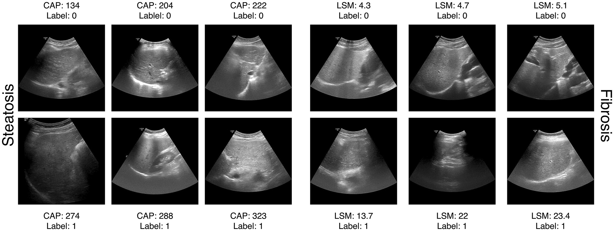

# Deep learning for non-invasive detection of steatosis and fibrosis in MASLD: a multicenter study with a new fibroscan-labelled ultrasound dataset

[Kartik Bose](mailto:0xkbose@pm.me)^, [Priya Mudgil](mailto:mudgilpriya8@gmail.com)^, [Pankaj Gupta](mailto:pankajgupta959@gmail.com)^, [Samonee Ralmilay](mailto:samoneeralmilay321@gmail.com)^, [Niharika Dutta](mailto:nihu019.1998@gmail.com)^, [Ajay Gulati](mailto:drajaygulati@gmail.com)^, [Naveen Kalra](mailto:navkal2004@yahoo.com)^, [Madhumita Premkumar](mailto:drmadhumitap@gmail.com)^, [Sunil Taneja](mailto:drsuniltaneja20@gmail.com)^, [Nipun Verma](mailto:nipun29j@gmail.com)^, [Arka De](mailto:arkascore@gmail.com)^ & [Ajay Duseja](mailto:ajayduseja@yahoo.co.in)^

^ Postgraduate Institute of Medical Education and Research (PGIMER), Chandigarh, India

[[Paper](https://doi.org/10.1007/s00261-025-05309-9)]

This study aimed to develop and validate deep learning models for non-invasive assessment of hepatic steatosis and fibrosis using conventional B-mode ultrasound images, with Fibroscan-derived measurement as reference standard.

## Cite this paper

Bose, K., Mudgil, P., Gupta, P., Ralmilay, S., Dutta, N., Gulati, A., Kalra, N., Premkumar, M., Taneja, S., Verma, N., De, A., & Duseja, A. (2025). Deep learning for non-invasive detection of steatosis and fibrosis in MASLD: a multicenter study with a new fibroscan-labelled ultrasound dataset. *Abdominal Radiology*. https://doi.org/10.1007/s00261-025-05309-9
